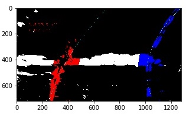

# Advanced Lane Finding
[](http://www.udacity.com/drive)

## Goals
The goal is to write a software pipeline to identify the lane boundaries in a video and a writeup (this).

The steps involved in this project are the following:

* Compute the camera calibration matrix and distortion coefficients given a set of chessboard images.
* Apply a distortion correction to raw images.
* Use color transforms, gradients, etc., to create a thresholded binary image.
* Apply a perspective transform to rectify binary image ("birds-eye view").
* Detect lane pixels and fit to find the lane boundary.
* Determine the curvature of the lane and vehicle position with respect to center.
* Warp the detected lane boundaries back onto the original image.
* Output visual display of the lane boundaries and numerical estimation of lane curvature and vehicle position.

#### Rubric
Here are the project [Rubric Points](https://review.udacity.com/#!/rubrics/571/view)

## Code organization
All the code related to this project is present as part of the jupyter notebook ```Advanced_Lane_Lines.ipynb```. These classes have been defined to provide a solution for this project.

|class|description|
|---|---|
|Camera|Camera class that can be used to calibrate, correct, unwarp images|
|Image|Container class for image with common image functions like grayscale, thresholding, annotating etc.|
|Line|Class to handle lane-line calculation and tracking from video frames|

## Camera Calibration
All the code related to this project is present as part of the jupyter notebook `Advanced_Lane_Lines.ipynb`. The camera is calibrated using the `camera_cal/calibration*.jpg` images. The code for calibrating is defined in `Camera.calibration` class method.

`objpoints` - The (x, y, z) coordinates of the chessboard corners in the real world with z=0. The same is replicated for each calibration image.
`imgpoints` - The (x, y) pixel positions in image plane as extracted using `cv2.findChessboardCorners`. Using the output `objpoints` and `imgpoints`, the camera calibration and distortion coefficients are calculated using the `cv2.calibrateCamera()` function and saved as part of the `Camera` class instance.

`Camera.correct_distortion` uses the distortion coeffiecients to correct images.

Example of distortion correction:


## Pipeline (Image)
##### Distortion correction
Implemented in `Camera.correct_distortion` using `cv2.undistort`. An example of this:


##### Thresholding
A combination of HLS and Sobel X Gradient thresholds is used to generate a binary image. The code is part of the `Image` class, `Image.threshold_or` function. An example of this: 


##### Perspective correction
The code for perspectice correction is part of the `Camera` class, `Camera.unwarp` function. `Camera.warp` is the inverse correction operation. 
Setting the perspective values is done using `Camera.set_perspective_abs` and `Camera.set_perspective_rel`.
An example of this: 
  
`set_perspective_rel` - uses relative (0.0-1.0) pixel positions to map from src points to dst points. dst is optional and offsets can be provided instead.  
`set_perspective_abs` - uses absolute pixel positions to map from src points to dst points. dst is optional and offsets can be provided instead.

##### Lane detection - Sliding window search 
The code for detecting lane using sliding window search is part of  `Line` class, `Line.fit_lane_poly` function. This function extracts a polynomial for each lane and saves it as part of the Line instance.
Examples of this: 
  
  

##### Reuse Lane polynomial
The code for reusing the  lane polynomials is `Line.use_last_lane_poly` function. First image frame uses sliding window search:

  


Subsequent image frames reuse the polynomial:

  
  

##### Radii and Offset 
The code for calculating the Radii of curvature and Lane Offset is `Line.track_and_mark_lanes` function.

##### Inverse perspective of detected Lane
The code for adding the detected lane is in `Line.track_and_mark_lanes` function. The lane image is created using `cv2.fillPoly`. It is then warped using the inverse matrix to project it into the camera plane. Then the input image and the warped lane image are blended to get the image of the lane super-imposed on the input video frame.
 

## Pipeline (video)
The output of the differnt video stages had been captured to understand the processing stages and finetune the different parameters of the pipeline.

##### Perspective corrected frames


##### Lane Detection using Sliding window search


##### Reuse Lane Polynomial


### Final Output
Complete processed output of `project_video.mp4` is uploaded here: [Project Video Output](https://github.com/barney-s/CarND-Advanced-Lane-Lines/blob/master/track_and_mark_lanes_project_video_output.mp4)


## Discussion
#### Approach
The approach taken to solve the lane-detection problem was:

1. Preprocess lane images to get a brids eye view of the lanes
2. Use sliding window to detect lane pixels in an image and extract a polynomial approximating the pixels.
3. Cache the polynomial coeffiecients and use that in the next frame to detect new lane pixels. using the new pixels approximate the next iteration of polynomial coeffiecients

#### Techniques used
1. Tried different combinations of thresholding. 
2. Tried varying the sliding window margin as well as the minpixels
3. Also varied the perspective src parameters


#### What worked and why
1. HLS and Sobel-x worked best to detect lane lines under varying illumination.
2. Perspective correction and thresholding resulted in a better lane image than thresholding followed by perspective correction.
3. Larger sliding window resulted in the detected lanes jumping a bit for certain curves since it was swayed by pixels detected outside the lanes
4. Thresholding minpix affected the ability to follow the right lane which was a series of broken white lines
5. Adjusting the perspective to remove the left-side wall helped in the case of "challenge_video.mp4", but that was not sufficient.


#### Weakness
1. Blind lane polynomial reuse fails in challenge_video.mp4
2. In on of the surface transitions in "project_video.mp4", the lane polynomial momemtarily veered left on a right curve
3. Multi surface seperators withing the lane confused both the "Sliding window search" and the "reuse lane polynomial" cases. Need to tune other parameters.


#### Improvements possible

1. Resort to Sliding Window search when lanes detected using Lane Polynomials are bad. Currently the sliding window search is done once and then we are reusing polynomial for detecting subsequent lanes. But this leads to a drift in the case of "challenge_video.mp4", where the lane detection goes awry. 
2. Sanity checks for the lane polynomials - check if they similar curvature and roughly parallel.
3. Check if the lanes are narrowing suddenly or increasing.
4. Smoothing by averaging detected lanes over time


## TODO
Adjust the pipeline to solve the `challenge_video.mp4` and `harder_challenge.mp4`.
