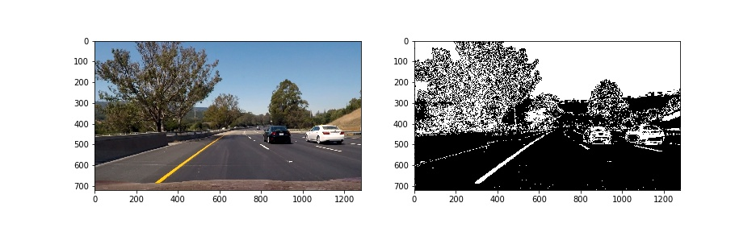
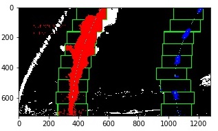
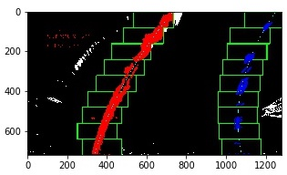
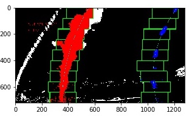
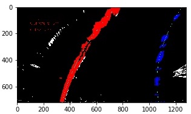
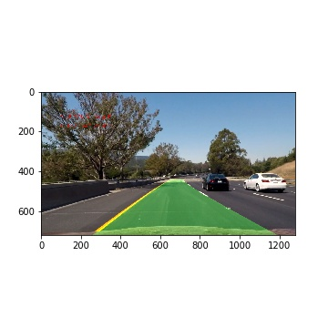

# Advanced Lane Finding
[](http://www.udacity.com/drive)

#### Goals

The goals / steps of this project are the following:

* Compute the camera calibration matrix and distortion coefficients given a set of chessboard images.
* Apply a distortion correction to raw images.
* Use color transforms, gradients, etc., to create a thresholded binary image.
* Apply a perspective transform to rectify binary image ("birds-eye view").
* Detect lane pixels and fit to find the lane boundary.
* Determine the curvature of the lane and vehicle position with respect to center.
* Warp the detected lane boundaries back onto the original image.
* Output visual display of the lane boundaries and numerical estimation of lane curvature and vehicle position.
* [Rubric Points](https://review.udacity.com/#!/rubrics/571/view)


### Writeup

You're reading it!

### Code organization
All the code related to this project is present as part of the jupyter notebook ```Advanced_Lane_Lines.ipynb```. These classes have been defined to provide a solution for this project.

|class|description|
|---|---|
|Camera|Camera class that can be used to calibrate, correct, unwarp images|
|Image|Container class for image with common image functions like grayscale, thresholding, annotating etc.|
|Line|Class to handle lane-line calculation and tracking from video frames|

### Camera Calibration
All the code related to this project is present as part of the jupyter notebook `Advanced_Lane_Lines.ipynb`. The camera is calibrated using the `camera_cal/calibration*.jpg` images. The code for calibrating is defined in `Camera.calibration` class method.

`objpoints` - The (x, y, z) coordinates of the chessboard corners in the real world with z=0. The same is replicated for each calibration image.
`imgpoints` - The (x, y) pixel positions in image plane as extracted using `cv2.findChessboardCorners`. Using the output `objpoints` and `imgpoints`, the camera calibration and distortion coefficients are calculated using the `cv2.calibrateCamera()` function and saved as part of the `Camera` class instance.

`Camera.correct_distortion` uses the distortion coeffiecients to correct images.

Example of distortion correction:


### Pipeline (Image)
##### Distortion correction
Implemented in `Camera.correct_distortion` using `cv2.undistort`. An example of this:


##### Thresholding
A combination of HLS and Sobel X Gradient thresholds is used to generate a binary image. The code is part of the `Image` class, `Image.threshold_or` function. An example of this: 


##### Perspective correction
The code for perspectice correction is part of the `Camera` class, `Camera.unwarp` function. `Camera.warp` is the inverse correction operation. 
Setting the perspective values is done using `Camera.set_perspective_abs` and `Camera.set_perspective_rel`.
An example of this: 
  
`set_perspective_rel` - uses relative (0.0-1.0) pixel positions to map from src points to dst points. dst is optional and offsets can be provided instead.  
`set_perspective_abs` - uses absolute pixel positions to map from src points to dst points. dst is optional and offsets can be provided instead.

##### Lane detection - Sliding window search 
The code for detecting lane using sliding window search is part of  `Line` class, `Line.fit_lane_poly` function. This function extracts a polynomial for each lane and saves it as part of the Line instance.
Examples of this: 
  
  
  

##### Reuse Lane polynomial
The code for reusing the  lane polynomials is `Line.use_last_lane_poly` function. First image frame uses sliding window search:
  
Subsequent image frames reuse the polynomial:
  
  

##### Radii and Offset 
The code for calculating the Radii of curvature and Lane Offset is `Line.track_and_mark_lanes` function.

##### Inverse perspective of detected Lane
The code for adding the detected lane is in `Line.track_and_mark_lanes` function. The lane image is created using `cv2.fillPoly`. It is then warped using the inverse matrix to project it into the camera plane. Then the input image and the warped lane image are blended to get the image of the lane super-imposed on the input video frame.
  
  
 

### Pipeline (video)

The final video 

Provide a link to your final video output.  Your pipeline should perform reasonably well on the entire project video (wobbly lines are ok but no catastrophic failures that would cause the car to drive off the road!).

Here's a [link to my video result](./project_video.mp4)

---

### Discussion

#### 1. Briefly discuss any problems / issues you faced in your implementation of this project.  Where will your pipeline likely fail?  What could you do to make it more robust?

Here I'll talk about the approach I took, what techniques I used, what worked and why, where the pipeline might fail and how I might improve it if I were going to pursue this project further.  
